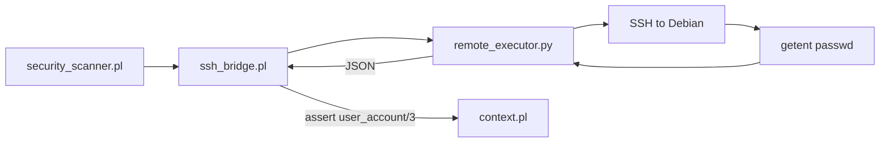

# Remote User Information: `getent passwd` vs `/etc/passwd`

## Short answer

**Yes — prefer `getent passwd` over reading `/etc/passwd` directly.**

For your project, that is the right Bash-level primitive. It returns the same colon-separated format, but goes through the **Name Service Switch (NSS)** so you see every account Debian considers valid — local `/etc/passwd` entries plus LDAP, SSSD, winbind, etc. if configured.

`cat /etc/passwd` only sees the local file and can miss accounts that still exist on the system.

## Why this fits your architecture

Your hybrid pattern is already established in [`python/remote_executor.py`](python/remote_executor.py) and [`src/ssh_bridge.pl`](src/ssh_bridge.pl):



- **Python** runs the remote command and parses structured output (same as `do_get_remote_processes`).
- **Prolog** reasons over facts — your [`check_nonstandard_uid0/4`](src/security_scanner.pl) already expects `user_account(User, 0, Home)` and compares against `standard_root_user/1` in [`config/default_policy.pl`](config/default_policy.pl).

Today, `user_account/3` exists only in mock data ([`tests/security_mock_facts.pl`](tests/security_mock_facts.pl)); it is **not** declared in [`src/context.pl`](src/context.pl) and **not** synced in `sync_facts_from_remote/3`. The UID-0 check is written but omitted from the active `collect_findings/1` append list.

## Recommended remote command

**Full account list** (for general enumeration):

```bash
getent passwd
```

Each line: `username:password:UID:GID:gecos:home:shell`

**UID-0 accounts only** (exactly what `check_nonstandard_uid0/4` needs):

```bash
getent passwd | awk -F: '$3 == 0 {print $1":"$3":"$6}'
```

Example output:

```
root:0:/root
toor:0:/root
```

**Login-capable human accounts** (useful later for “new/unexpected user” checks):

```bash
getent passwd | awk -F: '$7 !~ /(nologin|false)$/ {print $1":"$3":"$6":"$7}'
```

No `sudo` is required for `getent passwd`. Avoid `getent shadow` unless you later need locked/expired password state — that requires root and is a separate, more sensitive check.

## What `getent` does *not* cover

Keep these as **separate** remote commands (per your spec’s “unauthorized SSH keys” requirement):

| Need | Better command |
|------|----------------|
| SSH authorized keys | `find /home /root -name authorized_keys 2>/dev/null` |
| Recent home-dir creation | `find /home -maxdepth 1 -type d -mtime -7` |
| Last login activity | `lastlog` or parsing `/var/log/auth.log` / `journalctl` |
| Passwd file tampering | Already covered by `modified_file/2` on `/etc/passwd` |

Reading `/etc/passwd` directly duplicates the tampering signal you already collect; `getent` is for **account enumeration**, not file-integrity monitoring.

## Implementation sketch (when you wire it up)

Mirror the existing `get_remote_processes` flow:

### 1. Python — new `do_collect_users` in [`python/remote_executor.py`](python/remote_executor.py)

```python
CMD = "getent passwd"
# Parse each line: username, uid, home, shell
# Return JSON: {"users": [{"name": "...", "uid": 0, "home": "...", "shell": "..."}, ...]}
```

Filter in Python or Prolog; filtering UID 0 in Prolog keeps the policy declarative:

```prolog
check_nonstandard_uid0(...) :-
    user_account(User, 0, Home), ...
```

### 2. Prolog — extend [`src/context.pl`](src/context.pl)

```prolog
:- dynamic user_account/3.   % user_account(Name, UID, Home)
```

### 3. Prolog — sync in [`src/ssh_bridge.pl`](src/ssh_bridge.pl)

Add `sync_remote_users/3` to `sync_facts_from_remote/3`, following the same `retractall` → `maplist` → `assertz` pattern as `sync_remote_processes/3`.

### 4. Prolog — enable the check in [`src/security_scanner.pl`](src/security_scanner.pl)

Re-include `UID0Findings` in the `append/2` inside `collect_findings/1`.

## Prolog teaching note

This is the same **facts + rules** lesson as Lesson 1, applied to live data:

- **Fact**: `user_account('haxor', 0, '/home/haxor').` — something observed on the host.
- **Rule**: `check_nonstandard_uid0` — “suspicious because UID is 0 **and** name is not in `standard_root_user/1`.”
- **Negation as failure** (`\+ standard_root_user(User)`) — “we have no policy fact saying this account is expected.”

`getent` gives you trustworthy facts; Prolog decides whether they are policy violations.

## Recommendation

| Approach | Verdict |
|----------|---------|
| `cat /etc/passwd` | Works on simple systems, but incomplete and inconsistent with NSS |
| `getent passwd` | **Best default** for account enumeration in this project |
| `getent passwd \| awk ...` | Best when you only need UID-0 or login-shell filtering |
| Reading shadow / lastlog | Add later for deeper account-security checks |

No code changes are required to answer the question; the natural next step is adding `do_collect_users` and syncing `user_account/3` so your existing `check_nonstandard_uid0/4` runs against real remote data.